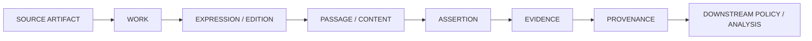

<div align="center">


# RGBL

## SCRIPTURE & REVELATION REFERENCE INTELLIGENCE

### **TRACE THE TEXT.**

#### SOURCE · PASSAGE · ASSERTION · EVIDENCE · PROVENANCE

A provenance-first **multi-tradition text, scripture, sacred-literature, and evidence corpus** for exact passages, editions, expressions, scoped assertions, source provenance, and reproducible downstream use.

**MOONWITNESS · ROCKSOUL RESEARCH · STORY × EVENT × PERSON × RGBL × AWS**

<br/>

[](https://github.com/bjo163/rocksoul-rgbl/actions/workflows/ci.yml)


<br/>

[Architecture](#text-intelligence-graph) · [Corpus contract](#canonical-corpus-contract) · [Coverage](#multi-tradition-coverage) · [Documentation](#documentation) · [Assets](https://github.com/bjo163/rocksoul-assets) · [Console](https://github.com/bjo163/rocksoul-crayon)

</div>

---

> **RGBL preserves what the source text says before any downstream engine decides how to weigh it.**

A text can exist in the corpus without being authoritative for every consumer.  
A community can call a work revelation without turning that scoped claim into universal corpus truth.  
A translation is not the source text.  
A textual parallel is not identity.  
An assessment is not a universal verdict.  
A corpus record is not a Mizan policy.

That separation is the foundation of RGBL.

## Visual + console boundary

<div align="center">


</div>

- **`rocksoul-assets`** owns the visual language and workspace references.
- **`rocksoul-crayon`** exposes TEXT resources through shared search, AutoMenu, cases, and AI-workspace surfaces.
- **RGBL remains canonical owner of exact TEXT / corpus identity / provenance.**

## Core question

```text
WHAT is the exact work / expression / edition?
WHAT passage or content segment?
WHICH language and script?
WHICH source artifact?
WHAT rights permit use?
WHAT provenance produced this record?
WHAT scoped assertion does a source or community make?
WHICH evidence supports that assertion?
```

## Golden rule

### **TEXTUAL PRESENCE ≠ UNIVERSAL AUTHORITY**

RGBL can preserve many religious and philosophical traditions while keeping authority, revelation, canon, role, identity, and doctrinal status explicitly scoped.

## Text intelligence graph



<div align="center">

### **TEXT ≠ INTERPRETATION · INCLUSION ≠ AUTHORITY**

</div>

## MoonWitness / Rocksoul research map

| Repository | Layer | Core question / role |
|---|---|---|
| [`rocksoul-assets`](https://github.com/bjo163/rocksoul-assets) | DESIGN | How should the ecosystem look? |
| [`rocksoul-crayon`](https://github.com/bjo163/rocksoul-crayon) | CONSOLE | How do operators work across it? |
| [`rocksoul-mftl`](https://github.com/bjo163/rocksoul-mftl) | STORY | What was told? |
| [`rocksoul-legend`](https://github.com/bjo163/rocksoul-legend) | EVENT | What happened? |
| [`rocksoul-superhero`](https://github.com/bjo163/rocksoul-superhero) | PERSON | Who was involved? |
| **`rocksoul-rgbl`** | TEXT | What does the exact text say? |
| [`rocksoul-aws`](https://github.com/bjo163/rocksoul-aws) | LAW | Was it allowed? |

```text
DESIGN  → ASSETS
CONSOLE → CRAYON
STORY   → MFTL
EVENT   → LEGEND
PERSON  → SUPERHERO
TEXT    → RGBL
LAW     → AWS
```

RGBL owns canonical `mw:*` corpus identity for works, passages, content, resources, assertions, evidence, provenance, and corpus assessments. It does **not** absorb MFTL narratives, LEGEND events, SUPERHERO actor/transmission records, or AWS legal conclusions.

[Read the interoperability contract →](docs/ROCKSOUL_INTEROP.md)

## Four-way proof case

### **CASE 001 — JERUSALEM 70 CE**

RGBL contributes **exact text only**:

```text
mw:passage:sblgnt:v1-2:mark:13:2
mw:passage:web-classic:2020:mar:13:2
```

Those existing canonical passage IDs are reused directly. No duplicate scripture object was created for the integration.

```text
RGBL      Mark 13:2 exact text
   ↓
MFTL      temple-destruction prediction narrative
   ↓
LEGEND    Jerusalem / Second Temple destruction, 70 CE
   ↑
SUPERHERO Flavius Josephus — witness / recorder
```

The proof works precisely because the repositories **do not collapse into each other**. RGBL proves what the selected text expression says; it does not prove event historicity or supernatural fulfillment.

[Read the shared case →](docs/cases/JERUSALEM-70-TEMPLE.md)

## Canonical corpus contract

RGBL keeps six universal record concerns separate:

```text
ENTITY
RESOURCE
ASSERTION
EVIDENCE
PROVENANCE
ASSESSMENT
```

Textual profiles add:

```text
WORK
EXPRESSION
EDITION
ARTIFACT
PASSAGE
CONTENT
ALIGNMENT
VARIANT
```

Database tables and search indexes are **derived artifacts**. Canonical knowledge remains in versioned corpus data and provenance.

## Multi-tradition coverage

The corpus includes source-preserving or source-pinned material across multiple traditions, including:

- Qur'an and Islamic textual/devotional datasets;
- Hebrew Bible / Westminster Leningrad Codex;
- SBL Greek New Testament and multiple Bible expressions/translations;
- Buddhist Pali and translated collections;
- Hindu, Daoist, Confucian, Zoroastrian, Sikh, Jain, Baháʼí, Shinto, and related textual datasets;
- lexicons, alignments, world-religion registries, and scoped person/role assertions.

Coverage does not imply theological equivalence, equal authority, or a closed universal taxonomy.

## Technical engine

The technical implementation retains the internal name **MoonWitness Corpus Engine**.

```text
TypeScript
pnpm + Turborepo
canonical JSON / JSONL
deterministic ingestion recipes
generated SQLite + FTS5
Fastify 5 REST API
OpenTelemetry + Prometheus
typed SDK + CLI
```

Runtime databases, FTS indexes, caches, and search artifacts must remain rebuildable from released corpus inputs.

## Quick start

```bash
pnpm install
pnpm check
pnpm serve
```

Useful endpoints:

```text
GET /docs
GET /metrics
GET /v1/health
GET /v1/traditions
GET /v1/works
GET /v1/works/:id/passages
GET /v1/search?q=...
GET /v1/devotionals?tradition=...
GET /v1/compare?theme=...
```

Use the CLI:

```bash
pnpm cli read bhagavad-gita 2:47
pnpm cli read hadith-nawawi 1
pnpm cli read kojiki 1:1
pnpm cli search "keadilan"
```

## Reproducible ingestion

```bash
pnpm upstream:audit
pnpm sync:all
pnpm check
```

```text
UPSTREAM SOURCE
      ↓
PINNED ARTIFACT / REVISION
      ↓
RECIPE + PARSER + NORMALIZER
      ↓
CANONICAL DATA
      ↓
CHECKSUM / PROVENANCE / RIGHTS
```

## Research principles

**ASSERTION ≠ GLOBAL FACT.**  
**TRANSLATION ≠ SOURCE IDENTITY.**  
**SIMILARITY ≠ EQUIVALENCE.**  
**CORPUS INCLUSION ≠ NORMATIVE ADMISSIBILITY.**  
**RELIGIOUS ROLE ≠ UNQUALIFIED IDENTITY.**  
**ENGINE POLICY STAYS DOWNSTREAM.**  
**MISSING ≠ FALSE.**  
**PROVENANCE IS REQUIRED.**

## Repository atlas

```text
rocksoul-rgbl/
├── data/            canonical corpus + provenance
├── docs/            corpus contracts, cases, roadmap
├── packages/        engine, SDK, API and supporting packages
├── schemas/         machine-valid corpus contracts
├── scripts/         ingestion, validation and audits
└── .github/         CI, release and synchronization workflows
```

## Documentation

| Document | Purpose |
|---|---|
| [Documentation index](docs/README.md) | Entry point to corpus documentation |
| [Rocksoul interoperability](docs/ROCKSOUL_INTEROP.md) | Cross-repository ownership contract |
| [Implementation roadmap](docs/ROADMAP.md) | Current implementation horizon |
| [Dataset targets](docs/DATASET_TARGETS.md) | Corpus acquisition targets |
| [World registry targets](docs/WORLD_REGISTRY_TARGETS.md) | Multi-tradition registry targets |
| [Jerusalem 70 CE](docs/cases/JERUSALEM-70-TEMPLE.md) | Shared four-way proof case |

---

<div align="center">


## **TRACE THE TEXT.**

### **SOURCE · PASSAGE · ASSERTION · EVIDENCE · PROVENANCE**

**Preserve first. Interpret downstream. Reproduce always.**

`RGBL / MoonWitness · Rocksoul Research`

</div>


## Branch model

```text
main  ← stable / release
dev   ← all development
```

Corpus ingestion, materialization, API/runtime, docs and release preparation land in `dev`. Stable promotion is `dev → main`.

[Read the branching contract →](docs/BRANCHING.md)
